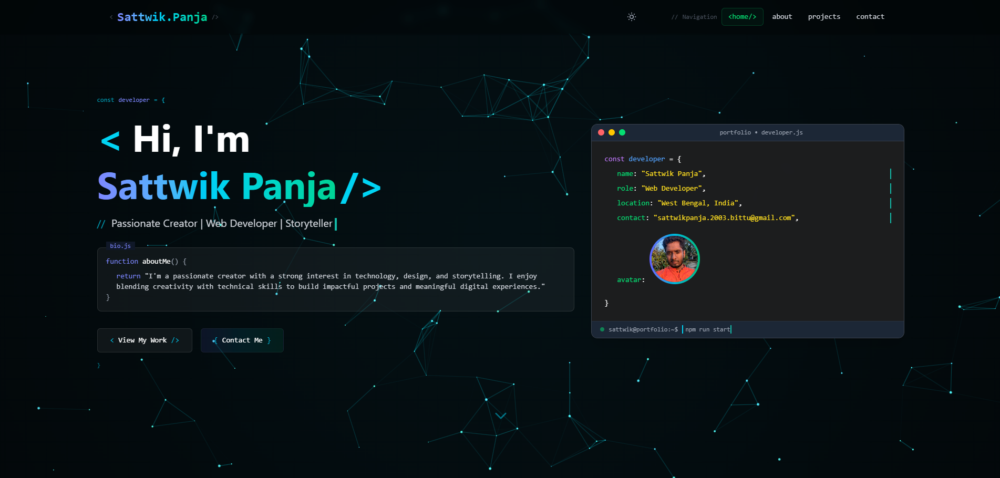

# Modern Developer Portfolio



A sleek, interactive developer portfolio built with React, Vite, and Tailwind CSS that features a terminal-inspired design, smooth animations, and responsive layout.

## 🚀 Features

- **Terminal-Inspired Design**: Code editor aesthetics with syntax highlighting
- **Dynamic Content**: Animated components with typewriter effects
- **Responsive Layout**: Fully optimized for all device sizes
- **Interactive Elements**: Hover effects and smooth scrolling
- **Dark Mode Support**: Default dark theme with light mode toggle
- **Reading Progress Bar**: Visual indicator of scroll position
- **Performance Optimized**: Fast loading and smooth animations

## 💻 Tech Stack

- **Frontend Framework**: React with Hooks
- **Build Tool**: Vite for lightning-fast development
- **Styling**: Tailwind CSS for utility-first styling
- **Animations**: Custom CSS animations and transitions
- **State Management**: React Context API
- **Deployment**: Optimized for Netlify/Vercel deployment

## 🛠️ Development Process

### Planning & Design
1. Created wireframes and mockups to visualize the portfolio layout
2. Selected a developer-centric dark theme color palette
3. Designed the terminal-inspired UI components
4. Planned smooth animations and transitions

### Implementation
1. Set up project with Vite and React
2. Implemented core layout and responsive design with Tailwind CSS
3. Created custom components for each portfolio section
4. Added terminal-style code editor with syntax highlighting
5. Implemented smooth page transitions and scroll animations
6. Built interactive navigation with scroll tracking
7. Added reading progress indicator

### Optimization
1. Optimized images and assets
2. Implemented lazy loading for improved performance
3. Added smooth animations without compromising performance
4. Tested across multiple browsers and devices
5. Ensured accessibility compliance

## 🔧 Installation & Setup

1. Clone the repository
   ```bash
   git clone https://github.com/yourusername/my-portfolio.git
   cd my-portfolio
   ```
2. Install dependencies
   ```bash
   npm install
   ```
3. Start the development server
   ```bash
   npm run dev
   ```
4. Open your browser and visit `http://localhost:3000`

## 📂 Folder Structure

```
src/
├── assets/            # Asset files like images and fonts
├── components/        # Reusable React components
├── layouts/           # Layout components for different pages
├── pages/             # Page components for routing
├── styles/           # Global styles and Tailwind CSS configuration
└── App.jsx            # Main App component
public/
├── assets/            # Static assets like images and icons
└── index.html         # Main HTML file
```

## 📄 License

This project is licensed under the MIT License - see the [LICENSE](LICENSE) file for details.

---

> **Note**: This portfolio template is designed for developers to showcase their work. Customize it to fit your own projects and style preferences.
